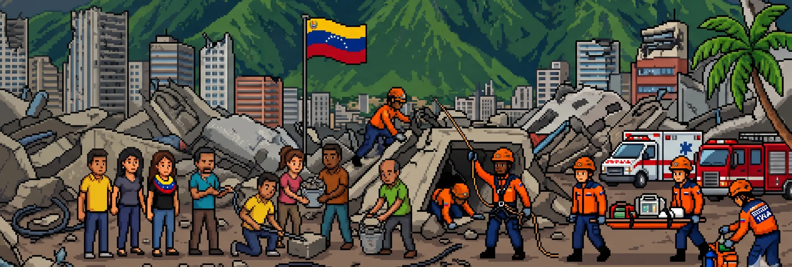

  

# 🚨 Páginas Amarillas: Sismo Vzla

> 📍 Directorio web de contingencia centralizado y de código abierto.
> 🌐 **Sitio en vivo:** [sismove.info](https://sismove.info)

A raíz del reciente movimiento telúrico en nuestro país, la información vital (listas de desaparecidos, estatus de hospitales, centros de acopio) se dispersó rápidamente a través de cadenas y redes sociales. 

Este proyecto nace con el objetivo de **centralizar, verificar y organizar** todas las herramientas de ayuda e iniciativas digitales en un solo punto de acceso, tanto para la ciudadanía como para los equipos de respuesta.

---

## 📖 Origen y Otros Proyectos

Esta plataforma nació como una respuesta rápida a la emergencia dentro del servidor de Discord de la comunidad de desarrolladores de Venezuela. 

Aunque el desarrollo principal de **este** directorio (Sismo Vzla) lo estoy manteniendo actualmente de forma independiente, en ese Discord existen **muchos otros proyectos, herramientas y equipos** organizándose para ayudar en la contingencia. 

Si eres programador, diseñador, analista de datos o voluntario, y quieres sumar tus habilidades a otras iniciativas tecnológicas, te invito a unirte a la comunidad:
👉 **[Únete al Discord de contingencia aquí](https://discord.gg/A4UJRturq)**

---

## 🛠️ ¿Cómo colaborar con este directorio?

Si conoces algún centro de acopio, refugio, base de datos de rescate o iniciativa que deba ser indexada en esta página, o si eres dev y quieres ayudar a mejorar el código de la plataforma, ¡tu aporte es fundamental!

Puedes colaborar de las siguientes maneras:

1. **Código / Propuestas:** Haz un *Fork* de este repositorio, añade las mejoras o datos en los archivos JSON correspondientes, y envía un *Pull Request*.
2. **Contacto Directo:** Si no sabes programar pero tienes información verificada para agregar a la página, contactame.

---

  <strong>"En momentos de crisis, el código abierto y la organización ciudadana salvan vidas."</strong>

